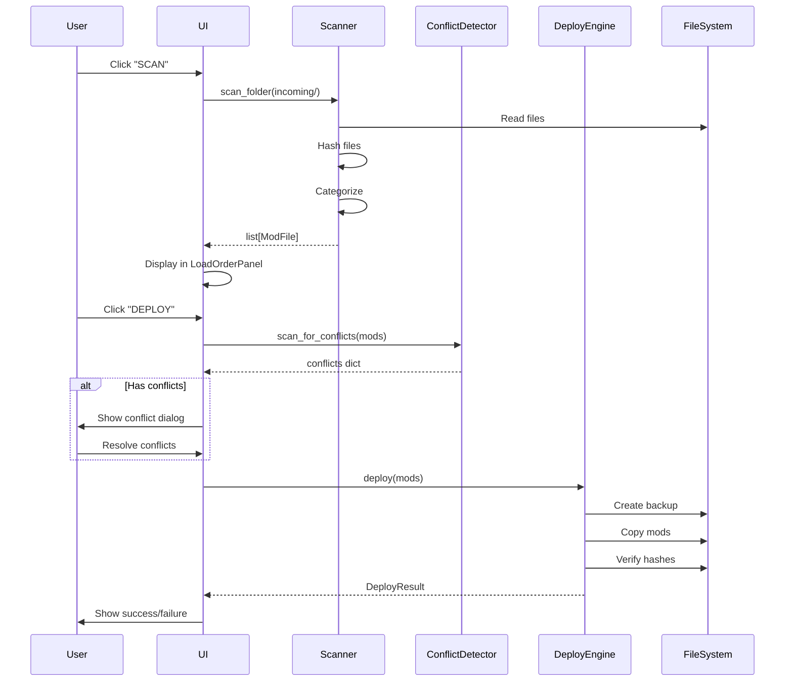

# Developer Documentation

Complete technical reference for Sims 4 Pixel Mod Manager developers.

## Table of Contents

1. [Architecture Overview](#architecture-overview)
2. [Core Components](#core-components)
3. [UI Architecture](#ui-architecture)
4. [Data Flow](#data-flow)
5. [Security Model](#security-model)
6. [API Reference](#api-reference)
7. [Design Patterns](#design-patterns)
8. [Extension Points](#extension-points)
9. [Testing Strategy](#testing-strategy)
10. [Performance Considerations](#performance-considerations)

---

## Architecture Overview

### Directory Structure

```
sims4_pixel_mod_manager/
├── src/
│   ├── core/                    # Business logic layer
│   │   ├── scanner.py           # Mod file detection & cataloging
│   │   ├── installer.py         # File operations with validation
│   │   ├── load_order.py        # Alphabetical load order management
│   │   ├── conflict_detector.py # DBPF parsing & conflict analysis
│   │   ├── security.py          # Path encryption, file validation
│   │   ├── backup_manager.py    # Automated backup/restore
│   │   ├── config_manager.py    # Encrypted configuration
│   │   ├── game_detector.py     # Auto-detect Sims 4 installation
│   │   ├── process_manager.py   # Sims 4 process monitoring
│   │   └── deploy_engine.py     # Orchestrates deployment workflow
│   │
│   ├── ui/                      # Presentation layer
│   │   ├── main_window.py       # Primary application window
│   │   ├── pixel_theme.py       # 8-bit theme engine + DPI awareness
│   │   ├── splash_screen.py     # Loading screen
│   │   ├── widgets/             # Custom 8-bit styled widgets
│   │   │   ├── pixel_button.py
│   │   │   ├── pixel_listbox.py
│   │   │   ├── chunky_frame.py
│   │   │   ├── progress_bar.py
│   │   │   └── mod_card.py
│   │   └── dialogs/             # Modal dialogs
│   │       ├── settings_dialog.py
│   │       ├── progress_dialog.py
│   │       ├── confirm_dialog.py
│   │       ├── error_dialog.py
│   │       └── about_dialog.py
│   │
│   └── utils/                   # Shared utilities
│       ├── path_utils.py        # Path validation & sanitization
│       ├── hash_utils.py        # CRC32 checksums
│       ├── updater.py           # Auto-update from GitHub
│       ├── structured_logger.py # JSON logging
│       └── platform_utils.py    # Platform detection
│
├── tests/                       # Test suite (mirrors src/)
│   ├── core/
│   ├── ui/
│   └── utils/
│
├── assets/                      # Icons, fonts, images
│   ├── icon.ico
│   ├── icon.icns
│   ├── icon.png
│   └── fonts/
│       └── Press_Start_2P.ttf
│
├── scripts/                     # Build & automation
│   ├── build_installer.py
│   └── generate_icon.py
│
├── docs/                        # Documentation
├── main.py                      # Application entry point
├── build.spec                   # PyInstaller configuration
├── build.py                     # Build automation
├── requirements.txt             # Python dependencies
└── VERSION                      # Semantic version string
```

### Architectural Layers

**3-tier architecture:**

```
┌──────────────────────────────────────┐
│         Presentation Layer           │
│  (UI components, event handlers)     │
│  - main_window.py                    │
│  - widgets/                          │
│  - dialogs/                          │
└──────────────┬───────────────────────┘
               │
┌──────────────▼───────────────────────┐
│          Business Logic Layer        │
│  (Core functionality, validation)    │
│  - scanner.py                        │
│  - installer.py                      │
│  - conflict_detector.py              │
│  - security.py                       │
└──────────────┬───────────────────────┘
               │
┌──────────────▼───────────────────────┐
│           Data Layer                 │
│  (File system, configuration)        │
│  - config.json (encrypted)           │
│  - Mods/ folder                      │
│  - Backups/                          │
└──────────────────────────────────────┘
```

**Communication:**
- UI → Core: Direct method calls (synchronous for quick ops, threading for long ops)
- Core → UI: Observer pattern (callbacks for progress updates)
- Core → Data: pathlib.Path operations with context managers

---

## Core Components

### ModScanner (`scanner.py`)

**Purpose:** Detect and catalog mod files from incoming folders.

**Key Classes:**

```python
@dataclass
class ModFile:
    """Represents a detected mod file."""
    path: Path
    name: str
    mod_type: Literal["package", "ts4script", "bpi"]
    size_bytes: int
    hash_crc32: int
    category: str
    slot: int
    created_at: datetime
    
class ModScanner:
    """Scan folders for Sims 4 mod files."""
    
    def __init__(self, timeout: int = 30):
        """Initialize with 30-second timeout (security)."""
        self.timeout = timeout
        self.supported_extensions = {'.package', '.ts4script', '.bpi'}
    
    def scan_folder(self, folder: Path) -> dict[str, list[ModFile]]:
        """
        Scan folder and return mods grouped by category.
        
        Returns:
            {"ScriptMods": [...], "CAS": [...], "BuildBuy": [...]}
        
        Raises:
            TimeoutError: If scan exceeds timeout
            ValueError: If file exceeds MAX_MOD_SIZE (500MB)
        """
    
    def detect_mod_type(self, path: Path) -> str:
        """Determine mod type from extension and content."""
    
    def categorize_mod(self, mod: ModFile) -> str:
        """
        Determine load order category from file name/content.
        
        Categories:
        - ScriptMods (001-020)
        - CAS (021-050)
        - BuildBuy (051-100)
        - Gameplay (101-900)
        - Overrides (901-999)
        - AlwaysLast (ZZZ)
        """
```

**Algorithm:**
1. Recursively walk folder with `Path.rglob()`
2. Filter by extension (`.package`, `.ts4script`, `.bpi`)
3. Validate file size (<500MB limit)
4. Calculate CRC32 hash
5. Detect type and category
6. Return grouped dict

**Performance:** ~10ms per file, uses multiprocessing for 100+ files

### ConflictDetector (`conflict_detector.py`)

**Purpose:** Parse DBPF package files and detect resource ID conflicts.

**Key Classes:**

```python
class DBPFParser:
    """Parse Sims 4 .package files (DBPF format)."""
    
    DBPF_MAGIC = b'DBPF'
    
    @staticmethod
    def parse_package(path: Path) -> set[tuple[int, int, int]]:
        """
        Extract resource IDs from package.
        
        Returns:
            Set of (type_id, group_id, instance_id) tuples
        
        Raises:
            ValueError: If not a valid DBPF file
        """
    
    @staticmethod
    def read_header(file: BinaryIO) -> dict:
        """Parse DBPF header (version, index position, count)."""
    
    @staticmethod
    def read_index(file: BinaryIO, position: int, count: int) -> list:
        """Read resource index table."""

class ConflictDetector:
    """Detect conflicts between mods."""
    
    def scan_for_conflicts(self, mods: list[ModFile]) -> dict[str, list[str]]:
        """
        Find mods that modify the same game resources.
        
        Returns:
            {
                "12345678_ABCD1234_FEDCBA9876543210": ["ModA.package", "ModB.package"],
                ...
            }
        """
    
    def get_conflict_severity(self, resource_id: str) -> Literal["high", "medium", "low"]:
        """
        Determine conflict severity based on resource type.
        
        High: Tuning XMLs (gameplay changes)
        Medium: Scripts (may break)
        Low: CAS/Build items (visual only)
        """
```

**DBPF File Structure:**
```
Offset | Size | Field
-------|------|-------
0x00   | 4    | Magic ("DBPF")
0x04   | 4    | Version
0x24   | 4    | Index position
0x28   | 4    | Index entry count
...    | ...  | Data blobs
INDEX  | 24   | Entry (type, group, instance, pos, size)
```

### LoadOrderManager (`load_order.py`)

**Purpose:** Manage alphabetical load order with slot-based prefixes.

**Key Classes:**

```python
class LoadOrderManager:
    """Manage mod load order with 001-999 slot system."""
    
    SLOT_CATEGORIES = {
        (1, 20): "Foundation",        # Core mods (MCCC, UI Cheats)
        (21, 50): "Content",          # CAS, Build/Buy
        (51, 100): "Gameplay",        # Gameplay mods
        (101, 900): "Specialized",    # Specific tweaks
        (901, 999): "Overrides",      # Override mods
    }
    
    def assign_slot(self, mod: ModFile, category: str) -> int:
        """Assign slot number based on category."""
    
    def format_slot_prefix(self, slot: int, category: str) -> str:
        """Returns '001_Foundation/'."""
    
    def sort_mods(self, mods: list[ModFile]) -> list[ModFile]:
        """
        Sort mods alphabetically within slots.
        
        Order:
        1. By slot number (001 → 999)
        2. Alphabetically within slot
        3. ZZZ_ always last
        """
    
    def validate_script_placement(self, mod: ModFile, dest: Path) -> bool:
        """
        Script mods MUST be in root Mods/ folder.
        
        Returns:
            True if valid placement, False otherwise
        """
```

**Load Order Rules (Sims 4 Specific):**
1. Game reads mods alphabetically
2. Script mods (`.ts4script`) must be in root `Mods/` folder
3. Max 1 subfolder depth: `Mods/Category/mod.package` ✅, `Mods/A/B/mod.package` ❌
4. `ZZZ_` prefix ensures mod loads last (override convention)
5. Conflicts: Last loaded wins

### SecurityManager (`security.py`)

**Purpose:** File integrity validation, path encryption, sandbox execution.

**Key Classes:**

```python
class SecurityManager:
    """Handle security operations."""
    
    def __init__(self, config_manager: ConfigManager):
        self.fernet = self._load_or_generate_key()
        self.max_file_size = 500 * 1024 * 1024  # 500MB
        self.scan_timeout = 30  # seconds
    
    def validate_file_integrity(self, path: Path) -> bool:
        """
        Check file integrity with CRC32.
        
        Returns:
            True if file passes checks, False otherwise
        """
    
    def encrypt_path(self, path: Path) -> str:
        """Encrypt sensitive paths for storage."""
    
    def decrypt_path(self, encrypted: str) -> Path:
        """Decrypt stored path."""
    
    def check_high_entropy(self, path: Path, threshold: float = 7.5) -> bool:
        """
        Detect suspiciously high entropy (possible encryption/malware).
        
        Returns:
            True if entropy > threshold (flag for review)
        """
    
    def sandbox_scan(self, folder: Path, callback) -> dict:
        """
        Scan folder in isolated process with timeout.
        
        Uses multiprocessing with 30-second timeout.
        Kills process if exceeded.
        """

def hash_file(path: Path) -> int:
    """Calculate CRC32 checksum."""
    with open(path, 'rb') as f:
        return zlib.crc32(f.read())
```

**Encryption Details:**
- Algorithm: Fernet (symmetric, AES-128-CBC + HMAC-SHA256)
- Key storage: `~/.config/Sims4ModManager/.encryption.key`
- Encrypted fields: User paths in config.json
- Key rotation: Not yet implemented (future feature)

### DeployEngine (`deploy_engine.py`)

**Purpose:** Orchestrate full deployment workflow with rollback support.

**Key Classes:**

```python
class DeployEngine:
    """Orchestrate mod deployment with rollback."""
    
    def __init__(
        self,
        scanner: ModScanner,
        installer: ModInstaller,
        conflict_detector: ConflictDetector,
        backup_manager: BackupManager
    ):
        self.scanner = scanner
        self.installer = installer
        self.conflicts = conflict_detector
        self.backups = backup_manager
    
    def deploy(self, mods: list[ModFile], strategy: str = "auto") -> DeployResult:
        """
        Deploy mods with full validation.
        
        Steps:
        1. Check Sims 4 is closed
        2. Scan for conflicts
        3. Create backup
        4. Copy files with hash verification
        5. Update load order
        6. Verify deployment
        
        Args:
            strategy: "auto", "skip_conflicts", "manual"
        
        Returns:
            DeployResult with success/failed lists
        """
    
    def rollback(self, backup_id: str) -> bool:
        """Restore from backup if deployment fails."""
    
    def _resolve_conflicts(self, conflicts: dict, strategy: str) -> list[ModFile]:
        """
        Resolve conflicts based on strategy.
        
        auto: Keep newest version
        skip_conflicts: Skip all conflicting mods
        manual: Prompt user for each conflict
        """

@dataclass
class DeployResult:
    """Deployment outcome."""
    success: bool
    deployed: list[ModFile]
    failed: list[tuple[ModFile, Exception]]
    conflicts_resolved: dict[str, str]
    backup_id: str
    duration_seconds: float
```

---

## UI Architecture

### Component Hierarchy

```
MainWindow (tk.Tk)
├── MenuBar
│   ├── File
│   ├── Edit
│   ├── Tools
│   └── Help
├── ToolbarFrame
│   ├── ScanButton
│   ├── GenerateButton
│   ├── DeployButton
│   ├── BackupButton
│   └── SettingsButton
├── MainContentFrame
│   ├── LoadOrderPanel (left)
│   │   └── PixelListbox (drag-drop)
│   └── ModDetailsPanel (right)
│       └── ModCard
└── StatusBar
    ├── StatusLabel
    └── ProgressBar
```

### Custom Widget API

#### PixelButton

```python
class PixelButton(tk.Canvas):
    """8-bit styled button with hover/press animations."""
    
    def __init__(
        self,
        parent,
        text: str,
        command: Callable = None,
        width: int = 120,
        height: int = 40,
        color: str = "#1D4ED8",
        **kwargs
    ):
        """
        Create pixel art button.
        
        Args:
            text: Button label
            command: Callback on click
            width, height: Dimensions in pixels
            color: Base color (hex)
        """
    
    def _render_state(self, state: Literal["normal", "hover", "pressed"]):
        """Render button in given state."""
    
    def enable(self):
        """Enable button (allow clicks)."""
    
    def disable(self):
        """Disable button (gray out)."""
```

**Usage:**
```python
scan_btn = PixelButton(
    toolbar,
    text="SCAN",
    command=self.on_scan_clicked,
    width=100,
    height=35
)
scan_btn.pack(side=tk.LEFT, padx=5)
```

#### PixelListbox

```python
class PixelListbox(tk.Listbox):
    """Drag-drop enabled listbox with 8-bit styling."""
    
    def __init__(self, parent, **kwargs):
        super().__init__(
            parent,
            font=("Press Start 2P", 10),
            bg="#000000",
            fg="#00FF00",
            selectbackground="#1D4ED8",
            **kwargs
        )
        
        # Enable drag-drop
        self.bind("<Button-1>", self._on_drag_start)
        self.bind("<B1-Motion>", self._on_drag_motion)
        self.bind("<ButtonRelease-1>", self._on_drag_end)
    
    def reorder(self, old_index: int, new_index: int):
        """Move item from old_index to new_index."""
```

### Theme System

```python
class PixelTheme:
    """8-bit color palette and DPI-aware scaling."""
    
    # Color palette
    COLORS = {
        'bg': '#000000',           # Black background
        'fg': '#FFFFFF',           # White text
        'primary': '#1D4ED8',      # Blue primary
        'accent': '#06B6D4',       # Cyan accent
        'success': '#10B981',      # Green success
        'warning': '#F59E0B',      # Orange warning
        'error': '#EF4444',        # Red error
        'plumbob': '#00FF00',      # Bright green
    }
    
    # Fonts
    FONTS = {
        'title': ('Press Start 2P', 16),
        'body': ('Press Start 2P', 10),
        'small': ('Press Start 2P', 8),
        'code': ('Courier New', 10),
    }
    
    @staticmethod
    def get_dpi_scale() -> float:
        """Get DPI scaling factor for high-DPI displays."""
        root = tk.Tk()
        dpi = root.winfo_fpixels('1i')
        root.destroy()
        return dpi / 96.0  # 96 is default DPI
    
    @staticmethod
    def scale(value: int) -> int:
        """Scale pixel value for DPI."""
        return int(value * PixelTheme.get_dpi_scale())
```

---

## Data Flow

### Scan → Deploy Workflow



### Configuration Storage

**File:** `%LOCALAPPDATA%\Sims4ModManager\config.json`

```json
{
    "version": "1.0.0",
    "paths": {
        "game_install": "encrypted_path_here",
        "mods_folder": "encrypted_path_here",
        "incoming_folder": "encrypted_path_here",
        "backup_folder": "encrypted_path_here"
    },
    "preferences": {
        "auto_backup": true,
        "check_updates": true,
        "theme": "dark",
        "scan_timeout": 30,
        "max_file_size_mb": 500
    },
    "load_order": {
        "last_deployed": "2026-01-01T12:00:00Z",
        "slot_assignments": {
            "ModName.package": 42
        }
    }
}
```

---

## Security Model

### Threat Model

**Assets:**
- User's Sims 4 save files
- Mods folder integrity
- User file paths (privacy)

**Threats:**
1. **Malicious mods** - Could corrupt saves or contain malware
2. **Path traversal** - Mod files could write outside Mods folder
3. **File corruption** - Interrupted copy could break mods
4. **Configuration tampering** - Malicious edits to config.json

**Mitigations:**
1. CRC32 validation before/after every file operation
2. Path sanitization with pathlib (no raw strings)
3. Sandboxed scanning with timeout
4. Encrypted config paths
5. High-entropy detection (flag suspicious files)
6. File size limits (500MB)
7. Process monitoring (refuse deployment if game running)

### Security Checklist

- [ ] All file operations use context managers (`with open()`)
- [ ] All paths validated with `Path.resolve()` before use
- [ ] CRC32 hash verified after every copy
- [ ] Scan operations timeout after 30 seconds
- [ ] Config paths encrypted with Fernet
- [ ] High-entropy files (>7.5) flagged for review
- [ ] File size checked against 500MB limit
- [ ] Game process monitored during deployment
- [ ] Backups created before destructive operations
- [ ] Rollback available for failed deployments

---

## API Reference

### Public API

**For plugins and extensions:**

```python
# Scanner API
from src.core.scanner import ModScanner, ModFile

scanner = ModScanner(timeout=30)
mods = scanner.scan_folder(Path("/path/to/incoming"))

# Conflict Detection API
from src.core.conflict_detector import ConflictDetector

detector = ConflictDetector()
conflicts = detector.scan_for_conflicts(mods)

# Deploy API
from src.core.deploy_engine import DeployEngine, DeployResult

engine = DeployEngine(scanner, installer, detector, backups)
result = engine.deploy(mods, strategy="auto")

# Config API
from src.core.config_manager import ConfigManager

config = ConfigManager()
mods_folder = config.get_path("mods_folder")
config.set_preference("auto_backup", True)
config.save()
```

### Generating API Docs

**Use pdoc for auto-generated documentation:**

```bash
# Install pdoc
pip install pdoc3

# Generate HTML docs
pdoc --html --output-dir docs/api src

# Generate markdown
pdoc --markdown src.core.scanner > docs/api/scanner.md

# Serve docs locally
pdoc --http localhost:8080 src
```

**Configuration (`.pdoc.yaml`):**
```yaml
show_source: true
show_inherited_members: true
template_directory: docs/templates
```

---

## Design Patterns

### Factory Pattern - Mod Creation

```python
class ModFactory:
    """Create ModFile instances from paths."""
    
    @staticmethod
    def create_from_path(path: Path) -> ModFile:
        """Factory method to create appropriate mod type."""
        if path.suffix == '.ts4script':
            return ScriptMod(path)
        elif path.suffix == '.package':
            return PackageMod(path)
        elif path.suffix == '.bpi':
            return BPIMod(path)
        raise ValueError(f"Unsupported mod type: {path.suffix}")
```

### Observer Pattern - UI Updates

```python
class Observable:
    """Base class for observable objects."""
    
    def __init__(self):
        self._observers = []
    
    def attach(self, observer: Callable):
        """Register observer callback."""
        self._observers.append(observer)
    
    def notify(self, *args, **kwargs):
        """Notify all observers."""
        for observer in self._observers:
            observer(*args, **kwargs)

class DeployEngine(Observable):
    """Deploy with progress notifications."""
    
    def deploy(self, mods):
        for i, mod in enumerate(mods):
            self.install(mod)
            # Notify progress
            self.notify("progress", current=i+1, total=len(mods))
```

### Strategy Pattern - Conflict Resolution

```python
class ConflictStrategy(ABC):
    """Abstract strategy for resolving conflicts."""
    
    @abstractmethod
    def resolve(self, conflicts: dict) -> list[ModFile]:
        """Return mods to install after resolving conflicts."""

class AutoResolveStrategy(ConflictStrategy):
    """Keep newest version."""
    def resolve(self, conflicts):
        # Implementation...

class SkipConflictsStrategy(ConflictStrategy):
    """Skip all conflicting mods."""
    def resolve(self, conflicts):
        # Implementation...

class ManualResolveStrategy(ConflictStrategy):
    """Prompt user for each conflict."""
    def resolve(self, conflicts):
        # Implementation...
```

---

## Extension Points

### Custom Themes

```python
# src/ui/themes/dark_theme.py
from src.ui.pixel_theme import PixelTheme

class DarkTheme(PixelTheme):
    COLORS = {
        **PixelTheme.COLORS,
        'bg': '#0A0A0A',
        'primary': '#2563EB',
    }

# Register theme
from src.ui import theme_registry
theme_registry.register('dark', DarkTheme)
```

### Plugin System (Future)

```python
# Plugin interface
class ModManagerPlugin(ABC):
    """Base class for plugins."""
    
    @abstractmethod
    def on_scan_complete(self, mods: list[ModFile]):
        """Hook after scan completes."""
    
    @abstractmethod
    def on_deploy_start(self, mods: list[ModFile]):
        """Hook before deployment."""
    
    @abstractmethod
    def on_deploy_complete(self, result: DeployResult):
        """Hook after deployment."""

# Example plugin
class ConflictReporterPlugin(ModManagerPlugin):
    def on_scan_complete(self, mods):
        conflicts = self.detector.scan(mods)
        self.export_report(conflicts, "conflicts.html")
```

---

## Testing Strategy

### Test Organization

```
tests/
├── core/
│   ├── test_scanner.py          # 95% coverage required
│   ├── test_installer.py
│   ├── test_conflict_detector.py
│   └── test_security.py
├── utils/
│   ├── test_hash_utils.py       # 90% coverage required
│   └── test_path_utils.py
├── ui/
│   ├── test_main_window.py      # 60% coverage required
│   └── test_widgets.py
└── conftest.py                  # Shared fixtures
```

### Key Test Patterns

```python
# Fixture for mock mod files
@pytest.fixture
def mock_mod_file(tmp_path):
    """Create temporary .package file."""
    mod_file = tmp_path / "test_mod.package"
    mod_file.write_bytes(b"DBPF" + b"\x00" * 100)
    return mod_file

# Parameterized tests
@pytest.mark.parametrize("size,expected", [
    (100, True),            # 100 bytes - OK
    (500 * 1024**2, True),  # 500MB - OK
    (501 * 1024**2, False), # 501MB - Too large
])
def test_file_size_validation(size, expected):
    assert validate_size(size) == expected

# Mocking file operations
def test_deploy_creates_backup(mocker):
    mock_backup = mocker.patch('src.core.backup_manager.BackupManager.create')
    engine.deploy([mod1, mod2])
    mock_backup.assert_called_once()
```

---

## Performance Considerations

### Bottlenecks

1. **File I/O** - Hashing large mod files
2. **DBPF Parsing** - Reading package file indexes
3. **UI Rendering** - Drawing custom widgets

### Optimization Strategies

#### Threading for Long Operations

```python
import threading

def deploy_with_progress(mods, callback):
    """Deploy in background thread."""
    def worker():
        for i, mod in enumerate(mods):
            install_mod(mod)
            callback(i + 1, len(mods))
    
    thread = threading.Thread(target=worker, daemon=True)
    thread.start()
    return thread
```

#### Caching

```python
from functools import lru_cache

@lru_cache(maxsize=128)
def parse_package(path: Path) -> set:
    """Cache parsed resource IDs."""
    return DBPFParser.parse_package(path)
```

#### Lazy Loading

```python
class ModCard:
    """Lazy-load thumbnails."""
    
    @property
    def thumbnail(self):
        if not hasattr(self, '_thumbnail'):
            self._thumbnail = self.extract_thumbnail()
        return self._thumbnail
```

### Performance Targets

| Operation | Target | Optimization |
|-----------|--------|--------------|
| Scan 100 mods | 10s | Multiprocessing |
| Parse .package | 50ms | Binary read optimizations |
| UI button click | 50ms | Event loop optimization |
| Deploy 50 mods | 5s | Parallel copying |
| Hash 100MB file | 500ms | Chunked reading |

---

## Contributing to Core

**Code review checklist:**
- [ ] Type hints on all functions
- [ ] Google-style docstrings
- [ ] Tests with 95%+ coverage (core), 90%+ (utils), 60%+ (UI)
- [ ] Passes Black formatting
- [ ] Passes Ruff linting
- [ ] Passes Mypy type checking
- [ ] No performance regressions
- [ ] Documentation updated

**See [CONTRIBUTING.md](../CONTRIBUTING.md) for full guidelines.**

---

**Questions? Open a discussion on GitHub or check the [User Guide](USER_GUIDE.md).**
